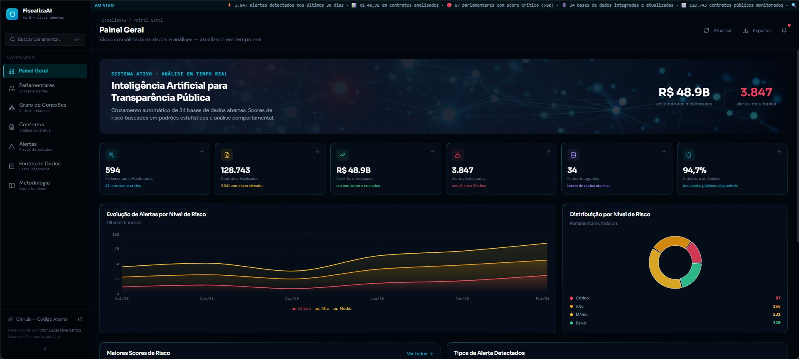

# FiscalizaAI — Plataforma de Análise de Dados Públicos

> **Inteligência Artificial para Transparência Pública e Controle Social**

<p align="center">
  
  <br>
  <em>Dashboard principal com análise de risco e visualização de dados públicos</em>
</p>

Uma plataforma open-source que utiliza inteligência artificial para cruzar dados de dezenas de bases abertas governamentais, identificar padrões de risco financeiro e visualizar redes de conexões entre parlamentares, empresas e contratos públicos.

[](LICENSE)
[](https://react.dev)
[](https://typescriptlang.org)
[](https://d3js.org)

---

## Sobre o Projeto

O **FiscalizaAI** é uma ferramenta de controle social desenvolvida para ampliar a transparência política no Brasil. A plataforma realiza o cruzamento automático de informações provenientes de dezenas de bases de dados abertas — incluindo TSE, Portal da Transparência, SIAFI, Receita Federal e portais estaduais — e organiza esses dados em um banco de grafos que mapeia conexões entre políticos, familiares, empresas e contratos públicos.

O sistema gera **scores de risco** baseados em padrões estatísticos, permitindo identificar possíveis casos de funcionários fantasmas, direcionamento de emendas parlamentares, contratos com familiares e outras inconsistências financeiras. A ferramenta é destinada a jornalistas investigativos, ONGs, órgãos de fiscalização e cidadãos interessados em transparência pública.

> **Nota legal:** Os scores de risco são indicadores estatísticos baseados em padrões de dados públicos e não constituem acusação, imputação de responsabilidade ou afirmação de irregularidade. Têm caráter exclusivamente analítico para fins de controle social.

---

## Funcionalidades

### Painel Geral
- Visão consolidada de estatísticas em tempo real
- Ticker de dados com atualizações contínuas
- Gráficos de evolução temporal de alertas
- Distribuição de scores de risco por nível
- Ranking de parlamentares por score de risco

### Análise de Parlamentares
- Score de risco individual (0–100%) com anel animado
- Detalhamento de alertas por tipo e valor envolvido
- Histórico de contratos e emendas parlamentares
- Rastreabilidade até a fonte primária dos dados

### Grafo de Conexões
- Visualização interativa de redes de relações com D3.js
- Conexões entre parlamentares, empresas, familiares e órgãos
- Filtros por tipo de entidade e nível de risco
- Detalhamento de cada nó e aresta ao clicar

### Análise de Contratos
- Tabela de contratos públicos com scores de risco
- Filtros por nível de risco, fornecedor e órgão
- Detecção de sobrepreço e concentração de fornecedor
- Vinculação de contratos a parlamentares

### Central de Alertas
- Alertas categorizados por tipo de irregularidade
- Valor financeiro envolvido em cada alerta
- Fontes de dados utilizadas na detecção
- Contribuição de cada alerta ao score geral

### Fontes de Dados
- Catálogo das 34+ bases integradas
- Status de sincronização e quantidade de registros
- Expansão contínua com novas fontes

### Metodologia
- Documentação transparente dos algoritmos
- Composição e pesos do score de risco
- Pipeline de análise passo a passo
- Princípios de segurança jurídica

---

## Fontes de Dados Integradas

| Fonte | Tipo | Registros |
|-------|------|-----------|
| TSE — Tribunal Superior Eleitoral | Eleitoral | 2,4M |
| Portal da Transparência Federal | Contratos | 128K |
| SIAFI — Sistema de Administração Financeira | Financeiro | 890K |
| SIAPE — Servidores Públicos | RH | 1,2M |
| Banco Central — Open Finance | Financeiro | 340K |
| Receita Federal — CNPJ | Empresarial | 56M |
| IBGE — Dados Municipais | Geográfico | 5,5K |
| TCU — Tribunal de Contas da União | Auditoria | 78K |
| Portais Estaduais de Transparência (27) | Contratos | 2,1M |
| Juntas Comerciais Estaduais | Empresarial | 4,8M |
| SINAPI — Preços de Referência | Preços | 12K |
| Diário Oficial da União | Normativo | 890K |

---

## Metodologia de Scores de Risco

O score de risco (0–100%) é calculado pela soma ponderada de seis indicadores principais:

| Indicador | Peso | Descrição |
|-----------|------|-----------|
| Concentração de Fornecedor | 25% | Percentual de contratos/emendas para único fornecedor |
| Variação Patrimonial | 20% | Desvio da variação patrimonial em relação à mediana |
| Vínculo Familiar em Contratos | 22% | Familiares como sócios de empresas contratadas |
| Sobrepreço em Contratos | 18% | Desvio do valor contratado vs. referencial SINAPI |
| Padrão de Emendas | 10% | Análise geográfica/temporal do direcionamento |
| Inconsistência em RH | 5% | Servidores comissionados com dados inconsistentes |

**Classificação dos Scores:**
- **Crítico (81–100):** Múltiplos indicadores com desvio severo — requer atenção imediata
- **Alto (61–80):** Desvio significativo em indicadores relevantes
- **Médio (41–60):** Desvio moderado, requer monitoramento
- **Baixo (0–40):** Padrão dentro da normalidade estatística

---

## Stack Tecnológico

| Camada | Tecnologia |
|--------|-----------|
| Framework | React 19 + TypeScript 5.6 |
| Estilização | Tailwind CSS 4 + shadcn/ui |
| Grafos | D3.js 7.9 (force simulation) |
| Gráficos | Recharts 2.15 |
| Roteamento | Wouter 3.3 |
| Animações | Framer Motion 12 |
| Tipografia | Sora + DM Sans + Fira Code |
| Build | Vite 7 |

---

## Instalação e Execução

### Pré-requisitos
- Node.js 22+
- pnpm 10+

### Passos

```bash
# Clonar o repositório
git clone https://github.com/oviteira/fiscaliza-ai.git
cd fiscaliza-ai

# Instalar dependências
pnpm install

# Iniciar servidor de desenvolvimento
pnpm dev

# Acessar em http://localhost:3000
```

### Build de Produção

```bash
pnpm build
pnpm start
```

---

## Estrutura do Projeto

```
fiscaliza-ai/
├── client/
│   ├── src/
│   │   ├── components/
│   │   │   ├── Layout.tsx          # Layout principal com sidebar
│   │   │   ├── Sidebar.tsx         # Navegação lateral
│   │   │   ├── Header.tsx          # Cabeçalho com ticker
│   │   │   ├── NetworkGraph.tsx    # Grafo D3 interativo
│   │   │   └── RiskScore.tsx       # Score de risco em anel
│   │   ├── pages/
│   │   │   ├── Home.tsx            # Painel geral
│   │   │   ├── Parlamentares.tsx   # Lista com scores
│   │   │   ├── Grafos.tsx          # Visualização de grafos
│   │   │   ├── Contratos.tsx       # Análise de contratos
│   │   │   ├── Alertas.tsx         # Central de alertas
│   │   │   ├── Fontes.tsx          # Fontes de dados
│   │   │   └── Metodologia.tsx     # Documentação metodológica
│   │   ├── lib/
│   │   │   └── mockData.ts         # Dados de demonstração
│   │   ├── App.tsx                 # Roteamento principal
│   │   └── index.css               # Design system
│   └── index.html
├── server/
│   └── index.ts                    # Servidor Express
├── README.md
├── CONTRIBUTING.md
├── LICENSE
└── package.json
```

---

## Contribuindo

Contribuições são muito bem-vindas! Este projeto é especialmente aberto a:

- **Jornalistas investigativos** — para identificar novas fontes de dados e padrões relevantes
- **Cientistas de dados** — para aprimorar os algoritmos de detecção de padrões
- **Advogados e especialistas em direito público** — para garantir segurança jurídica
- **Desenvolvedores** — para melhorar a plataforma e adicionar funcionalidades

Consulte [CONTRIBUTING.md](CONTRIBUTING.md) para detalhes sobre como contribuir.

### Áreas Prioritárias para Contribuição

1. **Integração com APIs reais** — Conectar às APIs do Portal da Transparência, TSE e demais fontes
2. **Algoritmos de ML** — Implementar modelos de machine learning para detecção de padrões
3. **Cobertura de dados** — Expandir para municípios e estados
4. **Exportação de relatórios** — PDF, CSV e formatos estruturados
5. **Internacionalização** — Adaptar para outros países da América Latina

---

## Roadmap

- [ ] **v1.1** — Integração com API real do Portal da Transparência Federal
- [ ] **v1.2** — Integração com API do TSE para dados eleitorais
- [ ] **v1.3** — Exportação de relatórios em PDF e CSV
- [ ] **v1.4** — Cobertura de municípios (dados do SICONFI)
- [ ] **v2.0** — Modelos de machine learning para detecção de padrões
- [ ] **v2.1** — API pública para integração com outras ferramentas
- [ ] **v2.2** — Alertas automáticos por e-mail/webhook
- [ ] **v3.0** — Cobertura de todos os estados e municípios brasileiros

---

## Licença

Este projeto está licenciado sob a [Licença MIT](LICENSE) — veja o arquivo LICENSE para detalhes.

---

## Autor

**Vitor Lucas Silva Santos**

Desenvolvido com o objetivo de fortalecer a democracia brasileira através da transparência pública e do controle social baseado em dados.

---

## Contato e Links

- **Site Oficial:** https://fiscalizaai.com.br
- **GitHub:** https://github.com/oviteira/fiscaliza-ai
- **Issues e Contribuições:** [GitHub Issues](https://github.com/oviteira/fiscaliza-ai/issues)

---

## Aviso Legal

Esta plataforma opera exclusivamente com dados públicos e abertos, disponibilizados pelos próprios órgãos governamentais. Os scores de risco apresentados são calculados por algoritmos estatísticos e não constituem acusação, imputação de responsabilidade ou afirmação de irregularidade. Para investigações formais, consulte os órgãos competentes: CGU, TCU, Ministério Público Federal e estaduais.

---

*"Fiscalizar é fiscalizar. Dados abertos são o instrumento da democracia."*
>>>>>>> dcde0c7 (feat: primeiro commit fiscaliza-ai)
